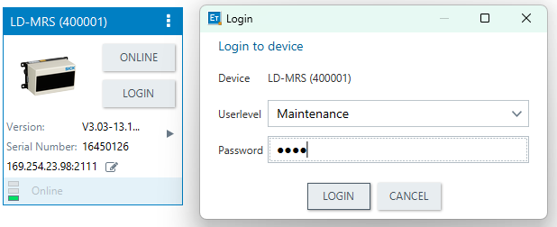

# SICK-LD-MRS400001

The SICK LD-MRS400001 is a versatile 3D LiDAR sensor designed for outdoor applications, offering a wide field of view and multiple scan layers for comprehensive environmental mapping. It is commonly utilized in autonomous vehicles, robotics, and industrial automation for tasks such as object detection, collision avoidance, and navigation.

Key Features:

- **Field of View:** The sensor provides a horizontal aperture angle of 85°, which can be extended to 110° using two additional scan layers, and a vertical aperture angle of 3.2°. 

- **Working Range:** It operates effectively within a range of 0.5 meters to 320 meters, accommodating various application needs. 

- **Scan Layers:** Equipped with four scan layers, the LD-MRS400001 enhances spatial resolution and object detection capabilities. 

- **Echo Evaluation:** The sensor evaluates up to three echoes per pulse, improving detection reliability in challenging environmental conditions. 

## Step 1 Configure lidar IP using the SOPAS Engineering Tool.

You must locate the Lidar IP address using the SOPAS Engineering Tool, which is only available for **Windows**. You can obtain the tool from the link provided below.

[Download SOPAS Engineering Tool]

[Download SOPAS Engineering Tool]: https://www.sick.com/th/en/catalog/products/digital-services-and-software/software/sopas-engineering-tool/p/p367244?tab=downloads

Complete the installation of the application, then launch it and connect it to your PC using LAN Ethernet and **9-27V**.

**Add a Device in SOPAS Engineering Tool:**

To scan for linked devices, click the Search icon next to it. Then right-click to add a device.

**Change IP-address:**

To configure the IP address of Lidar for the first time, right-click on the box and select "Change IP-address". 

Next, select "automatic" to allow SOPAS to generate the correct IP address for Lidar. If you wish to generate your own IP address, ensure that your IP address, subnetmask, and gateway are in alignment. Subsequently, click "OK."

Next, disconnect the device, re-plug it, and complete

### Optional: Visual Point Cloud on SOPAS

Click on the "Login" button, then select "Maintainance." Enter the password "main." If you desire an alternative mode, please refer to the image below.

Click on the "open device windows" option in the kabab menu.

Then, double-click on the Field Evaluation Monitor. After that, click on the tool with a circle symbol surrounding it until you find the points cloud.

## Step 2: Setup Lidar in ROS2 (Ubuntu)

